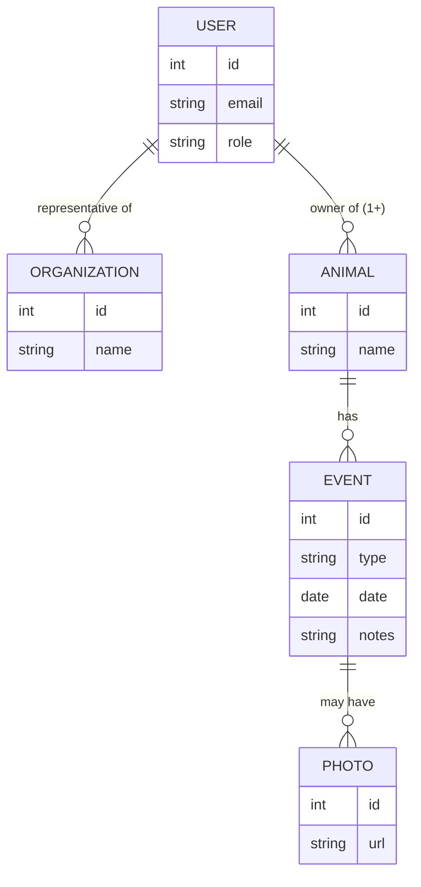

# Data logic and definitions
```
USERS can be representatives of ORGANIZATIONS.
USER can be owner of ANIMAL.
ANIMAL always has at least one owner who is USER.
EVENT always belongs to ANIMAL:
    - Event types:
        - Registration - Initial animal registration
        - Microchipping - Microchip implantation
        - Sterilization - Sterilization procedures
        - Neutering - Neutering/castration procedures
        - Vaccination - Vaccination events
        - Examination - Medical check-ups and examinations
        - Surgery - Surgical procedures
        - Bandage - Bandaging and wound care
        - IV - Intravenous treatments
        - Lost - Animal reported lost
        - Found - Animal found/recovered
        - RIP - Animal deceased
        - Other - Other event types not listed above
EVENT may have PHOTOS attached to them.
```

---

## Diagram



### Event types

| Type | Description |
|---|---|
| Registration | Initial animal registration |
| Microchipping | Microchip implantation |
| Sterilization | Sterilization procedures |
| Neutering | Neutering/castration procedures |
| Vaccination | Vaccination events |
| Examination | Medical check-ups and examinations |
| Surgery | Surgical procedures |
| Bandage | Bandaging and wound care |
| IV | Intravenous treatments |
| Lost | Animal reported lost |
| Found | Animal found/recovered |
| RIP | Animal deceased |
| Other | Other event types not listed above |